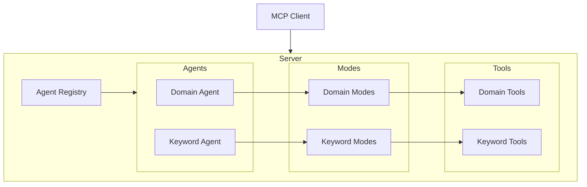
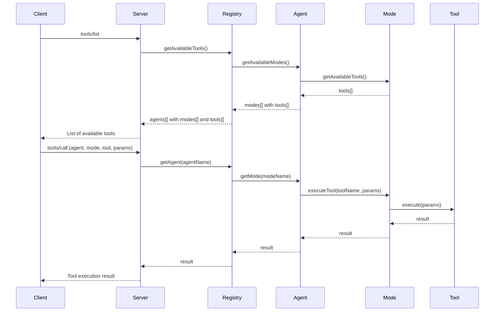
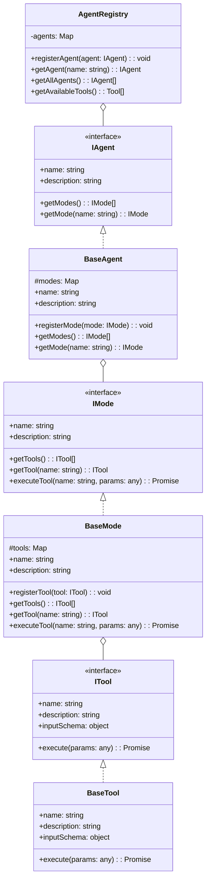
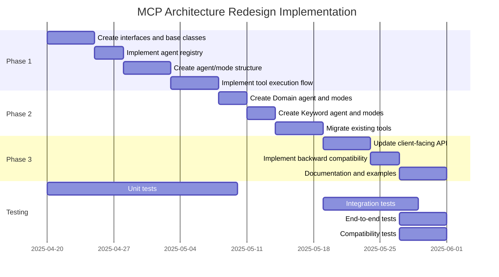

# Semrush MCP Architecture Redesign

This document outlines the architecture for consolidating Semrush MCP tools into domain-specific agents with specific modes.

## 1. High-Level Architectural Design

The new architecture will be organized around three key concepts:

1. **Agents**: Domain-specific categories (Domain and Keyword)
2. **Modes**: Each agent has multiple modes that represent different functionalities
3. **Tools**: Each mode exposes a specific subset of tools



### Key Components:

1. **Agent Registry**: Central registry that manages all agents and their modes
2. **Agent**: Represents a domain-specific category of functionality
3. **Mode**: Represents a specific functionality within an agent
4. **Tool**: Actual implementation of a specific function

### Request Flow:



## 2. Agent, Mode, and Tool Organization

Based on the current tools in the codebase, the organization will be as follows:

### Domain Agent
- **Overview Mode**
  - `domain_overview`: Get domain overview data
- **Competitors Mode**
  - `competitors`: Get competitors for a domain in organic search
- **Traffic Mode**
  - `traffic_summary`: Get traffic summary data for domains
  - `traffic_sources`: Get traffic sources data for a domain
- **Backlinks Mode**
  - `backlinks`: Get backlinks for a domain or URL
  - `backlinks_domains`: Get referring domains for a domain or URL

### Keyword Agent
- **Overview Mode**
  - `keyword_overview`: Get overview data for a keyword
  - `keyword_overview_single_db`: Get detailed overview for a keyword from a specific database
  - `batch_keyword_overview`: Analyze multiple keywords at once
- **Research Mode**
  - `related_keywords`: Get related keywords
  - `broad_match_keywords`: Get broad matches and alternate search queries
  - `phrase_questions`: Get question-based keywords
- **Competition Mode**
  - `keyword_organic_results`: Get domains ranking for a keyword
  - `keyword_paid_results`: Get domains in paid search results
  - `keyword_ads_history`: Get domains that bid on a keyword
- **Analysis Mode**
  - `keyword_difficulty`: Get difficulty index for ranking
- **Domain Keywords Mode**
  - `domain_organic_keywords`: Get organic keywords for a domain
  - `domain_paid_keywords`: Get paid keywords for a domain

## 3. Implementation Structure

The implementation will use a modular, object-oriented approach with TypeScript interfaces and classes:



### Core Files Structure

```
src/
├── index.ts                  # Main entry point
├── config.ts                 # Configuration
├── semrush-api.ts            # API client
├── agents/                   # Agent implementations
│   ├── agent-registry.ts     # Central registry
│   ├── base-agent.ts         # Base agent implementation
│   ├── domain-agent.ts       # Domain agent
│   └── keyword-agent.ts      # Keyword agent
├── modes/                    # Mode implementations
│   ├── base-mode.ts          # Base mode implementation
│   ├── domain/               # Domain modes
│   │   ├── overview-mode.ts
│   │   ├── competitors-mode.ts
│   │   ├── traffic-mode.ts
│   │   └── backlinks-mode.ts
│   └── keyword/              # Keyword modes
│       ├── overview-mode.ts
│       ├── research-mode.ts
│       ├── competition-mode.ts
│       ├── analysis-mode.ts
│       └── domain-keywords-mode.ts
└── tools/                    # Tool implementations
    ├── base-tool.ts          # Base tool implementation
    ├── domain/               # Domain tools
    └── keyword/              # Keyword tools
```

## 4. Implementation Details

### 4.1 Interfaces

```typescript
// Agent interface
interface IAgent {
  name: string;
  description: string;
  getModes(): IMode[];
  getMode(name: string): IMode | undefined;
}

// Mode interface
interface IMode {
  name: string;
  description: string;
  getTools(): ITool[];
  getTool(name: string): ITool | undefined;
  executeTool(name: string, params: any): Promise<any>;
}

// Tool interface
interface ITool {
  name: string;
  description: string;
  inputSchema: object;
  execute(params: any): Promise<any>;
}
```

### 4.2 Base Classes

```typescript
// Base agent implementation
class BaseAgent implements IAgent {
  protected modes: Map<string, IMode> = new Map();
  
  constructor(
    public name: string,
    public description: string
  ) {}
  
  registerMode(mode: IMode): void {
    this.modes.set(mode.name, mode);
  }
  
  getModes(): IMode[] {
    return Array.from(this.modes.values());
  }
  
  getMode(name: string): IMode | undefined {
    return this.modes.get(name);
  }
}

// Base mode implementation
class BaseMode implements IMode {
  protected tools: Map<string, ITool> = new Map();
  
  constructor(
    public name: string,
    public description: string
  ) {}
  
  registerTool(tool: ITool): void {
    this.tools.set(tool.name, tool);
  }
  
  getTools(): ITool[] {
    return Array.from(this.tools.values());
  }
  
  getTool(name: string): ITool | undefined {
    return this.tools.get(name);
  }
  
  async executeTool(name: string, params: any): Promise<any> {
    const tool = this.getTool(name);
    if (!tool) {
      throw new Error(`Tool not found: ${name}`);
    }
    return await tool.execute(params);
  }
}

// Base tool implementation
class BaseTool implements ITool {
  constructor(
    public name: string,
    public description: string,
    public inputSchema: object,
    private executeFunction: (params: any) => Promise<any>
  ) {}
  
  async execute(params: any): Promise<any> {
    return await this.executeFunction(params);
  }
}
```

### 4.3 Agent Registry

```typescript
class AgentRegistry {
  private agents: Map<string, IAgent> = new Map();
  
  registerAgent(agent: IAgent): void {
    this.agents.set(agent.name, agent);
  }
  
  getAgent(name: string): IAgent | undefined {
    return this.agents.get(name);
  }
  
  getAllAgents(): IAgent[] {
    return Array.from(this.agents.values());
  }
  
  getAvailableTools(): any[] {
    const tools: any[] = [];
    
    for (const agent of this.getAllAgents()) {
      for (const mode of agent.getModes()) {
        for (const tool of mode.getTools()) {
          tools.push({
            name: `${agent.name}.${mode.name}.${tool.name}`,
            description: tool.description,
            inputSchema: {
              ...tool.inputSchema,
              properties: {
                ...tool.inputSchema.properties,
                agent: { type: "string", default: agent.name },
                mode: { type: "string", default: mode.name }
              }
            }
          });
        }
      }
    }
    
    return tools;
  }
}
```

## 5. Examples of How the New Structure Would Work

### 5.1 Tool Registration

```typescript
// Create the agent registry
const agentRegistry = new AgentRegistry();

// Create and register the Domain agent
const domainAgent = new BaseAgent("domain", "Domain analysis tools");

// Create and register the Overview mode
const overviewMode = new BaseMode("overview", "Domain overview tools");

// Create and register the domain_overview tool
const domainOverviewTool = new BaseTool(
  "domain_overview",
  "Get domain overview data",
  {
    type: "object",
    properties: {
      domain: { type: "string", description: "Domain name to analyze" },
      database: { type: "string", description: "Database to use" }
    },
    required: ["domain"]
  },
  async (params) => {
    const { domain, database } = params;
    return await semrushApi.getDomainOverview(domain, database);
  }
);

// Register the tool with the mode
overviewMode.registerTool(domainOverviewTool);

// Register the mode with the agent
domainAgent.registerMode(overviewMode);

// Register the agent with the registry
agentRegistry.registerAgent(domainAgent);
```

### 5.2 Tool Execution

```typescript
// Handle tool execution
server.setRequestHandler(CallToolRequestSchema, async (request) => {
  try {
    // Parse the tool name to extract agent, mode, and tool
    const [agentName, modeName, toolName] = request.params.name.split(".");
    const params = request.params.arguments;
    
    // Get the agent from the registry
    const agent = agentRegistry.getAgent(agentName);
    if (!agent) {
      throw new Error(`Agent not found: ${agentName}`);
    }
    
    // Get the mode from the agent
    const mode = agent.getMode(modeName);
    if (!mode) {
      throw new Error(`Mode not found: ${modeName}`);
    }
    
    // Execute the tool
    const result = await mode.executeTool(toolName, params);
    
    return {
      content: [{ type: "text", text: JSON.stringify(result.data) }]
    };
  } catch (error) {
    logger.error(`Error while executing tool: ${(error as Error).message}`);
    return handleApiError(error);
  }
});
```

### 5.3 Tool Discovery

```typescript
// List available tools
server.setRequestHandler(ListToolsRequestSchema, async () => {
  const tools = agentRegistry.getAvailableTools();
  return { tools };
});
```

## 6. Migration Considerations

### 6.1 Phased Approach

We recommend a phased migration approach:

1. **Phase 1: Create the new architecture**
   - Implement the interfaces, base classes, and registry
   - Create the agent and mode structure
   - Implement the new tool execution flow

2. **Phase 2: Migrate existing tools**
   - Create Domain and Keyword agents
   - Create modes for each agent
   - Move tools to their appropriate modes

3. **Phase 3: Update client integration**
   - Update the client-facing API to support the new structure
   - Provide backward compatibility for existing clients
   - Document the new API structure

### 6.2 Backward Compatibility

To maintain backward compatibility:

1. **Tool Name Mapping**: Create a mapping from old tool names to new agent/mode/tool combinations
   ```typescript
   const LEGACY_TOOL_MAPPING = {
     "semrush_domain_overview": "domain.overview.domain_overview",
     "semrush_domain_organic_keywords": "keyword.domain_keywords.domain_organic_keywords",
     // ... other mappings
   };
   ```

2. **Legacy Endpoint**: Maintain the existing endpoint for backward compatibility
   ```typescript
   // Handle legacy tool calls
   server.setRequestHandler(CallToolRequestSchema, async (request) => {
     try {
       const toolName = request.params.name;
       
       // Check if this is a legacy tool name
       if (toolName.startsWith("semrush_")) {
         const newToolName = LEGACY_TOOL_MAPPING[toolName];
         if (newToolName) {
           // Redirect to the new tool
           request.params.name = newToolName;
           return await handleToolCall(request);
         }
       }
       
       // Handle normally
       return await handleToolCall(request);
     } catch (error) {
       logger.error(`Error while executing tool: ${(error as Error).message}`);
       return handleApiError(error);
     }
   });
   ```

3. **Deprecation Strategy**: Gradually phase out the old structure with clear deprecation notices

### 6.3 Testing Strategy

1. **Unit Tests**: Test each component (agent, mode, tool) in isolation
2. **Integration Tests**: Test the interaction between components
3. **End-to-End Tests**: Test the complete flow from client request to response
4. **Compatibility Tests**: Ensure backward compatibility with existing clients

## 7. Implementation Plan



## 8. Benefits of the New Architecture

1. **Improved Organization**: Clear separation of concerns with domain-specific agents
2. **Enhanced Flexibility**: Modes allow for different tool combinations based on context
3. **Better Maintainability**: Modular structure makes it easier to add, modify, or remove tools
4. **Reduced Duplication**: Common functionality can be shared across agents and modes
5. **Clearer API**: More intuitive API structure for clients
6. **Future Extensibility**: Easy to add new agents, modes, and tools as needed

## 9. Potential Challenges and Mitigations

1. **Challenge**: Increased complexity compared to the current flat structure
   **Mitigation**: Clear documentation and examples for developers

2. **Challenge**: Backward compatibility with existing clients
   **Mitigation**: Maintain legacy endpoints and provide a migration path

3. **Challenge**: Performance overhead from the additional abstraction layers
   **Mitigation**: Optimize critical paths and implement caching where appropriate

4. **Challenge**: Learning curve for developers
   **Mitigation**: Provide training and comprehensive documentation