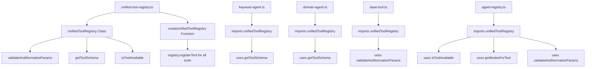
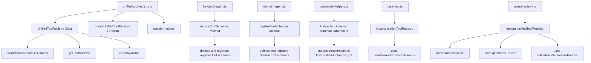

# Tool Schema Migration Plan

## Overview

This document outlines the plan for migrating tool schemas from the centralized `unified-tool-registry.ts` file to a more modular approach with agent-specific files. The current implementation has all tool schemas defined in one large file, which has led to configuration errors and maintenance challenges.

## Current Architecture

The current architecture centralizes all tool schema definitions in a single file:



## New Architecture

The new architecture moves tool schema definitions to agent-specific files:



## Migration Steps

### 1. Create a New Interface for Tool Schema Registration

Modify the `unified-tool-registry.ts` file to focus on the registry functionality without containing the actual tool definitions:

```typescript
// src/validation/unified-tool-registry.ts (modified)

// Keep the existing transformations
export const transformations = {
  commaStringToArray: (value: string): string[] => {
    // Existing implementation...
  },
  
  arrayToCommaString: (value: any[]): string => {
    // Existing implementation...
  },
  
  lowercase: (value: string): string => {
    // Existing implementation...
  },
  
  formatDomain: (value: string): string => {
    // Existing implementation...
  },
  
  formatDate: (value: string | Date): string => {
    // Existing implementation...
  }
};

// Keep the existing interfaces
export interface ParameterDefinition {
  // Existing implementation...
}

export interface ToolDefinition {
  // Existing implementation...
}

// Add a new interface for the registry
export interface IToolSchemaRegistry {
  registerTool(tool: ToolDefinition): void;
  getTool(name: string): ToolDefinition | undefined;
  getAllTools(): ToolDefinition[];
  getToolsForAgent(agentName: string): ToolDefinition[];
  getToolsForMode(modeName: string): ToolDefinition[];
  getToolsForAgentAndMode(agentName: string, modeName: string): ToolDefinition[];
  isToolAvailable(toolName: string, agentName: string, modeName: string): boolean;
  getModesForTool(toolName: string, agentName: string): string[];
  validateAndNormalizeParams(toolName: string, params: Record<string, any>): Record<string, any>;
  getToolSchema(toolName: string): object;
}

// Keep the existing UnifiedToolRegistry class but implement the interface
export class UnifiedToolRegistry implements IToolSchemaRegistry {
  // Existing implementation...
}

// Create and export a singleton instance
export const unifiedToolRegistry = new UnifiedToolRegistry();

/**
 * Create an empty unified tool registry
 */
export function createUnifiedToolRegistry(): UnifiedToolRegistry {
  return new UnifiedToolRegistry();
}
```

### 2. Create Helper Functions for Common Parameter Types

Create a new file with helper functions for common parameter types:

```typescript
// src/validation/parameter-helpers.ts (new file)
import { ParameterDefinition, transformations } from './unified-tool-registry.js';

/**
 * Create a keyword parameter definition
 */
export function createKeywordParam(required: boolean = true): ParameterDefinition {
  return {
    type: 'string',
    description: 'Keyword to analyze (e.g., "digital marketing", "seo tools")',
    required,
    aliases: ['phrase'],
    transform: transformations.lowercase
  };
}

/**
 * Create a database parameter definition
 */
export function createDatabaseParam(required: boolean = false): ParameterDefinition {
  return {
    type: 'string',
    description: 'Database to use (country code: "us", "uk", "ca", etc.)',
    required,
    enum: ['us', 'uk', 'ca', 'au', 'de', 'fr', 'es', 'it', 'br', 'ru', 'jp', 'in', 'cn'],
    default: required ? undefined : 'us'
  };
}

/**
 * Create a domain parameter definition
 */
export function createDomainParam(required: boolean = true): ParameterDefinition {
  return {
    type: 'string',
    description: 'Domain name to analyze (e.g., "semrush.com", "ahrefs.com") - do not include http:// or https://',
    required,
    transform: transformations.formatDomain
  };
}

/**
 * Create a limit parameter definition
 */
export function createLimitParam(required: boolean = false): ParameterDefinition {
  return {
    type: 'number',
    description: 'Maximum number of results to return (range: 1-1000)',
    required,
    minimum: 1,
    maximum: 1000,
    default: 100
  };
}
```

### 3. Move Tool Schema Definitions to Agent-Specific Files

Modify the KeywordAgent class to register its tool schemas:

```typescript
// src/agents/keyword-agent.ts (modified)
import { BaseAgent } from './base-agent.js';
import { BaseMode } from '../modes/base-mode.js';
import { BaseTool } from '../tools/base-tool.js';
import { semrushApi } from '../semrush-api.js';
import { unifiedToolRegistry } from '../validation/unified-tool-registry.js';
import { createKeywordParam, createDatabaseParam, createLimitParam } from '../validation/parameter-helpers.js';

/**
 * Keyword Agent - provides tools for keyword analysis
 */
export class KeywordAgent extends BaseAgent {
  constructor() {
    super('keyword', 'Keyword analysis tools');
    
    // Register tool schemas
    this.registerToolSchemas();
    
    // Initialize modes
    this.initializeOverviewMode();
    this.initializeResearchMode();
    this.initializeCompetitionMode();
    this.initializeAnalysisMode();
    this.initializeDomainKeywordsMode();
  }

  /**
   * Register tool schemas with the unified registry
   */
  private registerToolSchemas(): void {
    // Register keyword_overview tool
    unifiedToolRegistry.registerTool({
      name: 'keyword_overview',
      description: 'Get overview data for a keyword - provides search volume, CPC, competition, and other metrics',
      parameters: {
        keyword: createKeywordParam(true),
        database: createDatabaseParam(false)
      },
      modes: ['overview'],
      agents: ['keyword']
    });

    // Register keyword_overview_single_db tool
    unifiedToolRegistry.registerTool({
      name: 'keyword_overview_single_db',
      description: 'Get detailed overview data for a keyword from a specific database (10 API units per line)',
      parameters: {
        keyword: createKeywordParam(true),
        database: createDatabaseParam(true)
      },
      modes: ['overview'],
      agents: ['keyword']
    });

    // Register batch_keyword_overview tool
    unifiedToolRegistry.registerTool({
      name: 'batch_keyword_overview',
      description: 'Analyze up to 100 keywords at once in a specific database (10 API units per line)',
      parameters: {
        keywords: {
          type: 'array',
          description: 'Array of keywords to analyze (maximum 100)',
          required: true,
          maxItems: 100,
          items: {
            type: 'string',
            description: 'Keyword to analyze (e.g., "digital marketing", "seo tools")'
          },
          transform: unifiedToolRegistry.transformations.arrayToCommaString
        },
        database: createDatabaseParam(true)
      },
      modes: ['overview'],
      agents: ['keyword']
    });

    // Register related_keywords tool
    unifiedToolRegistry.registerTool({
      name: 'related_keywords',
      description: 'Get related keywords for a keyword - finds semantically related terms to expand your keyword list',
      parameters: {
        keyword: createKeywordParam(true),
        database: createDatabaseParam(false),
        limit: createLimitParam(false)
      },
      modes: ['research'],
      agents: ['keyword']
    });

    // Register broad_match_keywords tool
    unifiedToolRegistry.registerTool({
      name: 'broad_match_keywords',
      description: 'Get broad matches and alternate search queries for a keyword - finds variations and alternative phrasings (20 API units per line)',
      parameters: {
        keyword: createKeywordParam(true),
        database: createDatabaseParam(false),
        limit: createLimitParam(false)
      },
      modes: ['research'],
      agents: ['keyword']
    });

    // Register phrase_questions tool
    unifiedToolRegistry.registerTool({
      name: 'phrase_questions',
      description: 'Get questions containing the keyword - finds question-based search queries for content creation (20 API units per line)',
      parameters: {
        keyword: createKeywordParam(true),
        database: createDatabaseParam(false),
        limit: createLimitParam(false)
      },
      modes: ['research'],
      agents: ['keyword']
    });

    // Register domain_keywords tool
    unifiedToolRegistry.registerTool({
      name: 'domain_keywords',
      description: 'Get keywords for a specific domain - retrieves organic keywords that a domain ranks for',
      parameters: {
        domain: {
          type: 'string',
          description: 'Domain name to analyze (e.g., "semrush.com", "ahrefs.com") - do not include http:// or https://',
          required: true,
          transform: unifiedToolRegistry.transformations.formatDomain
        },
        database: createDatabaseParam(false)
      },
      modes: ['research'],
      agents: ['keyword']
    });

    // Register keyword_organic_results tool
    unifiedToolRegistry.registerTool({
      name: 'keyword_organic_results',
      description: 'Get organic search results for a keyword (10 API units per line)',
      parameters: {
        keyword: createKeywordParam(true),
        database: createDatabaseParam(false),
        limit: createLimitParam(false)
      },
      modes: ['competition'],
      agents: ['keyword']
    });

    // Register keyword_paid_results tool
    unifiedToolRegistry.registerTool({
      name: 'keyword_paid_results',
      description: 'Get paid search results for a keyword (10 API units per line)',
      parameters: {
        keyword: createKeywordParam(true),
        database: createDatabaseParam(false),
        limit: createLimitParam(false)
      },
      modes: ['competition'],
      agents: ['keyword']
    });

    // Register keyword_ads_history tool
    unifiedToolRegistry.registerTool({
      name: 'keyword_ads_history',
      description: 'Get historical ad copies for a keyword (10 API units per line)',
      parameters: {
        keyword: createKeywordParam(true),
        database: createDatabaseParam(false),
        limit: createLimitParam(false)
      },
      modes: ['competition'],
      agents: ['keyword']
    });

    // Register keyword_difficulty tool
    unifiedToolRegistry.registerTool({
      name: 'keyword_difficulty',
      description: 'Get difficulty scores for keywords (10 API units per line)',
      parameters: {
        keywords: {
          type: 'array',
          description: 'Array of keywords to analyze',
          required: true,
          items: {
            type: 'string',
            description: 'Keyword to analyze (e.g., "digital marketing", "seo tools")'
          },
          transform: unifiedToolRegistry.transformations.arrayToCommaString
        },
        database: createDatabaseParam(false)
      },
      modes: ['analysis'],
      agents: ['keyword']
    });

    // Register domain_organic_keywords tool
    unifiedToolRegistry.registerTool({
      name: 'domain_organic_keywords',
      description: 'Get organic keywords for a domain (10 API units per line)',
      parameters: {
        domain: {
          type: 'string',
          description: 'Domain name to analyze (e.g., "semrush.com", "ahrefs.com") - do not include http:// or https://',
          required: true,
          transform: unifiedToolRegistry.transformations.formatDomain
        },
        database: createDatabaseParam(false),
        limit: createLimitParam(false)
      },
      modes: ['domain_keywords'],
      agents: ['keyword']
    });

    // Register domain_paid_keywords tool
    unifiedToolRegistry.registerTool({
      name: 'domain_paid_keywords',
      description: 'Get paid keywords for a domain (10 API units per line)',
      parameters: {
        domain: {
          type: 'string',
          description: 'Domain name to analyze (e.g., "semrush.com", "ahrefs.com") - do not include http:// or https://',
          required: true,
          transform: unifiedToolRegistry.transformations.formatDomain
        },
        database: createDatabaseParam(false),
        limit: createLimitParam(false)
      },
      modes: ['domain_keywords'],
      agents: ['keyword']
    });
  }

  // Rest of the class remains the same...
}
```

Modify the DomainAgent class to register its tool schemas:

```typescript
// src/agents/domain-agent.ts (modified)
import { BaseAgent } from './base-agent.js';
import { BaseMode } from '../modes/base-mode.js';
import { BaseTool } from '../tools/base-tool.js';
import { semrushApi } from '../semrush-api.js';
import { unifiedToolRegistry } from '../validation/unified-tool-registry.js';
import { createDatabaseParam, createLimitParam } from '../validation/parameter-helpers.js';

/**
 * Domain Agent - provides tools for domain analysis
 */
export class DomainAgent extends BaseAgent {
  constructor() {
    super('domain', 'Domain analysis tools');
    
    // Register tool schemas
    this.registerToolSchemas();
    
    // Initialize modes
    this.initializeOverviewMode();
    this.initializeCompetitorsMode();
    this.initializeTrafficMode();
    this.initializeBacklinksMode();
  }

  /**
   * Register tool schemas with the unified registry
   */
  private registerToolSchemas(): void {
    // Register domain_overview tool
    unifiedToolRegistry.registerTool({
      name: 'domain_overview',
      description: 'Get overview data for a domain - provides comprehensive metrics including traffic, keywords, and rankings',
      parameters: {
        domain: {
          type: 'string',
          description: 'Domain name to analyze (e.g., "ahrefs.com", "moz.com") - do not include http:// or https://',
          required: true,
          transform: unifiedToolRegistry.transformations.formatDomain
        },
        database: createDatabaseParam(false)
      },
      modes: ['overview'],
      agents: ['domain']
    });

    // Register competitors tool
    unifiedToolRegistry.registerTool({
      name: 'competitors',
      description: 'Get competitors for a domain - identifies websites competing for the same keywords (10 API units per line)',
      parameters: {
        domain: {
          type: 'string',
          description: 'Domain name to analyze (e.g., "semrush.com", "ahrefs.com") - do not include http:// or https://',
          required: true,
          transform: unifiedToolRegistry.transformations.formatDomain
        },
        database: createDatabaseParam(false),
        limit: createLimitParam(false)
      },
      modes: ['competitors'],
      agents: ['domain']
    });

    // Register traffic_summary tool
    unifiedToolRegistry.registerTool({
      name: 'traffic_summary',
      description: 'Get traffic summary for up to 5 domains - provides traffic metrics for comparison (10 API units per line)',
      parameters: {
        domains: {
          type: 'array',
          description: 'Array of domains to analyze (maximum 5 domains)',
          required: true,
          maxItems: 5,
          items: {
            type: 'string',
            description: 'Domain to analyze (e.g., "semrush.com", "ahrefs.com")'
          },
          transform: unifiedToolRegistry.transformations.arrayToCommaString
        },
        country: {
          type: 'string',
          description: 'Country code (e.g., "us", "uk", "ca", etc.)',
          required: false,
          default: 'us'
        }
      },
      modes: ['traffic'],
      agents: ['domain']
    });

    // Register traffic_sources tool
    unifiedToolRegistry.registerTool({
      name: 'traffic_sources',
      description: 'Get traffic sources for a domain - breaks down traffic by source (10 API units per line)',
      parameters: {
        domain: {
          type: 'string',
          description: 'Domain name to analyze (e.g., "semrush.com", "ahrefs.com") - do not include http:// or https://',
          required: true,
          transform: unifiedToolRegistry.transformations.formatDomain
        },
        country: {
          type: 'string',
          description: 'Country code (e.g., "us", "uk", "ca", etc.)',
          required: false,
          default: 'us'
        }
      },
      modes: ['traffic'],
      agents: ['domain']
    });

    // Register backlinks tool
    unifiedToolRegistry.registerTool({
      name: 'backlinks',
      description: 'Get backlinks for a domain or URL - retrieves incoming links to the target (10 API units per line)',
      parameters: {
        target: {
          type: 'string',
          description: 'Domain or URL to analyze (e.g., "semrush.com", "ahrefs.com/blog")',
          required: true,
          transform: unifiedToolRegistry.transformations.formatDomain
        },
        limit: createLimitParam(false)
      },
      modes: ['backlinks'],
      agents: ['domain']
    });

    // Register backlinks_domains tool
    unifiedToolRegistry.registerTool({
      name: 'backlinks_domains',
      description: 'Get referring domains for a domain or URL - retrieves domains linking to the target (10 API units per line)',
      parameters: {
        target: {
          type: 'string',
          description: 'Domain or URL to analyze (e.g., "semrush.com", "ahrefs.com/blog")',
          required: true,
          transform: unifiedToolRegistry.transformations.formatDomain
        },
        limit: createLimitParam(false)
      },
      modes: ['backlinks'],
      agents: ['domain']
    });
  }

  // Rest of the class remains the same...
}
```

## Benefits of the New Architecture

1. **Improved Maintainability**: Each agent is responsible for its own tool schemas, making it easier to maintain and update.

2. **Reduced Configuration Errors**: Schemas are defined closer to where they're used, reducing the chance of errors.

3. **Better Organization**: Tool schemas are grouped by agent, making it easier to understand which tools belong to which agent.

4. **Easier to Add New Tools**: Just add the schema to the appropriate agent's registerToolSchemas method.

5. **Consistent Parameter Definitions**: Using helper functions ensures consistency across similar parameters.

6. **Shorter Files**: The unified-tool-registry.ts file is much shorter, focusing only on the registry functionality.

## Implementation Steps

1. **Create the IToolSchemaRegistry interface** in unified-tool-registry.ts
2. **Modify the UnifiedToolRegistry class** to implement the interface
3. **Create a singleton instance** of UnifiedToolRegistry
4. **Create the parameter-helpers.ts file** with helper functions
5. **Modify the KeywordAgent class** to register its tool schemas
6. **Modify the DomainAgent class** to register its tool schemas
7. **Update the createUnifiedToolRegistry function** to create an empty registry
8. **Test the changes** to ensure everything works correctly